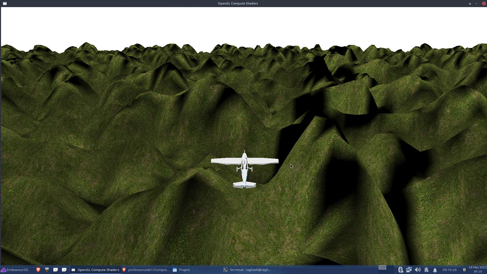

<h1>Flight Simulator Over Procedurally Generated Terrain</h1>
  
This is my project for my Computer Graphics Course. It uses a compute shader to create a terrain from simplex noise. The parameters can be changed from the parameters.json file. Here's a screenshot of the terrain with global illumination from the sun.

Here's what it looks like playing.

To use, git pull this project. In the project folder download and put the glm source code folder as well. Then use the make command. 

Credits for the assets 
Airplane by Poly by Google [CC-BY] (https://creativecommons.org/licenses/by/3.0/) via Poly Pizza (https://poly.pizza/m/8VysVKMXN2J)

Airplane by Poly by Google [CC-BY] (https://creativecommons.org/licenses/by/3.0/) via Poly Pizza (https://poly.pizza/m/8ciDd9k8wha)

Airplane by Poly by Google [CC-BY] (https://creativecommons.org/licenses/by/3.0/) via Poly Pizza (https://poly.pizza/m/a3XrQkLNna9)

Paper airplane by Poly by Google [CC-BY] (https://creativecommons.org/licenses/by/3.0/) via Poly Pizza (https://poly.pizza/m/75WQH5E29tF)

Aeroplane by Gilang Romadhan [CC-BY] (https://creativecommons.org/licenses/by/3.0/) via Poly Pizza (https://poly.pizza/m/9VeIc0cybp4)

Jet by jeremy [CC-BY] (https://creativecommons.org/licenses/by/3.0/) via Poly Pizza (https://poly.pizza/m/6fyLMORhgGK)

Small Airplane by Vojtěch Balák [CC-BY] (https://creativecommons.org/licenses/by/3.0/) via Poly Pizza (https://poly.pizza/m/7cvx6ex-xfL)

Dog in plane by Nikki Morin [CC-BY] (https://creativecommons.org/licenses/by/3.0/) via Poly Pizza (https://poly.pizza/m/6Y6MQye_n1h)

Wikiplanet Space Station (WSS) by Alan Zimmerman [CC-BY] (https://creativecommons.org/licenses/by/3.0/) via Poly Pizza (https://poly.pizza/m/emG0dq38D8f)

Hover Battler: Sparrow by Aaron Clifford [CC-BY] (https://creativecommons.org/licenses/by/3.0/) via Poly Pizza (https://poly.pizza/m/eGrzfhSGpOg)

Areosaur.1 by Yogoshimo 2.0 [CC-BY] (https://creativecommons.org/licenses/by/3.0/) via Poly Pizza (https://poly.pizza/m/f5rvt0Kbc49)

Lil plane by Thomas van iseghem (Superthomyboy) [CC-BY] (https://creativecommons.org/licenses/by/3.0/) via Poly Pizza (https://poly.pizza/m/5zd26VYRL2U)

Grass by hat_my_guy (https://poly.pizza/m/9S0fmIfGPO)

grass blades by Tiff Eidmann [CC-BY] (https://creativecommons.org/licenses/by/3.0/) via Poly Pizza (https://poly.pizza/m/7jaHZEe1exG)

Grass #1 by Tomáš Bayer [CC-BY] (https://creativecommons.org/licenses/by/3.0/) via Poly Pizza (https://poly.pizza/m/00rprwmzLKP)