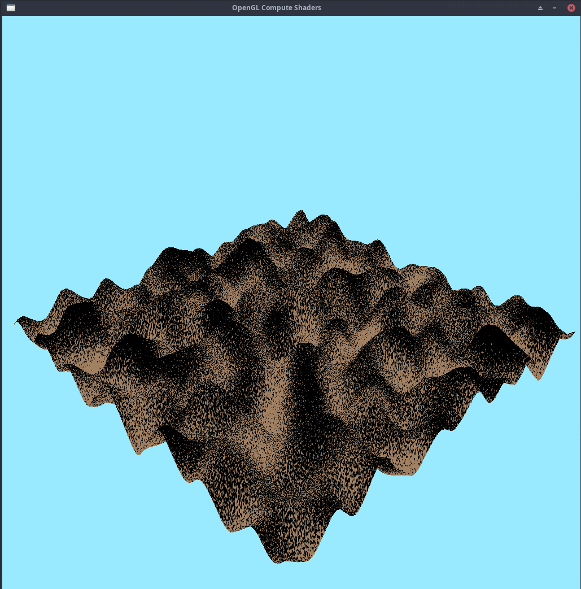

Alright. All shaders are doing the bare minimum they are supposed to.
  
Here's the heatmap of the procedurally generated terrain with a filthy texture
(to bring out the real shape of the terrain).

  
Here's the same terrain with global illumination from the sun

