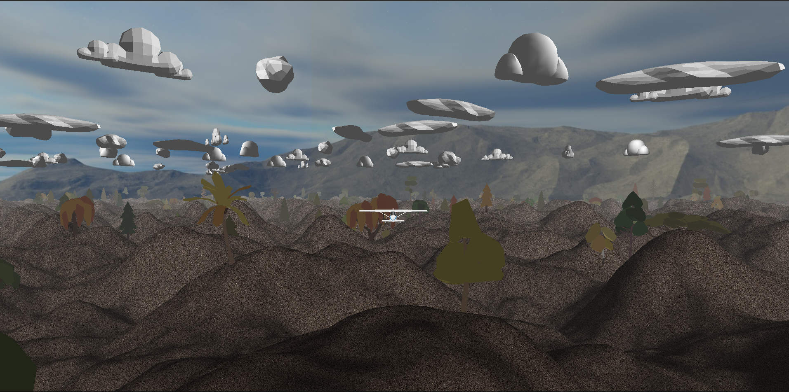

<h1>Flight Simulator </h1>
  

The terrain is generated using Perlin Noise (kind of) and 3 D perlin noise is used to generate dynamic flow field that change with time. 

To use
 
git pull this project. 
 
Install glfw3 on your system
 
download glm from github and place the glm library in the /usr/include directory.
 
Install make and just use the make command.
  
It won't run on windows (sorry :|). A lot of files have their positions hard coded relative to the executable. To use on windows you will have to find the names of all shaders and assets files and folders in the code and rename them with forward slashes. The clouds and trees constructor will also have to changed to use forward slash. And the `__builtin_trap` defined in the assert macro will have to be changed to something that windows supports.

<h6>Credits to the creators</h6>
  
Thanks to Yan Chernikov for their amazing OpenGL Series
 
Thanks to Niels Lohmann for the [JSON C++ Library](https://github.com/nlohmann/json)
 
Thanks to Ryo Suzuki for their C++ [Perlin Noise](https://github.com/Reputeless/PerlinNoise)
 
Thanks to Ashima Arts for their glsl implementations of [noises](https://github.com/ashima/webgl-noise) 

<h6>Credits for the assets </h6>
Airplane by Poly by Google [CC-BY] (https://creativecommons.org/licenses/by/3.0/) via Poly Pizza (https://poly.pizza/m/8VysVKMXN2J)

Airplane by Poly by Google [CC-BY] (https://creativecommons.org/licenses/by/3.0/) via Poly Pizza (https://poly.pizza/m/8ciDd9k8wha)

Airplane by Poly by Google [CC-BY] (https://creativecommons.org/licenses/by/3.0/) via Poly Pizza (https://poly.pizza/m/a3XrQkLNna9)

Paper airplane by Poly by Google [CC-BY] (https://creativecommons.org/licenses/by/3.0/) via Poly Pizza (https://poly.pizza/m/75WQH5E29tF)

Aeroplane by Gilang Romadhan [CC-BY] (https://creativecommons.org/licenses/by/3.0/) via Poly Pizza (https://poly.pizza/m/9VeIc0cybp4)

Jet by jeremy [CC-BY] (https://creativecommons.org/licenses/by/3.0/) via Poly Pizza (https://poly.pizza/m/6fyLMORhgGK)

Small Airplane by Vojtěch Balák [CC-BY] (https://creativecommons.org/licenses/by/3.0/) via Poly Pizza (https://poly.pizza/m/7cvx6ex-xfL)

Dog in plane by Nikki Morin [CC-BY] (https://creativecommons.org/licenses/by/3.0/) via Poly Pizza (https://poly.pizza/m/6Y6MQye_n1h)

Wikiplanet Space Station (WSS) by Alan Zimmerman [CC-BY] (https://creativecommons.org/licenses/by/3.0/) via Poly Pizza (https://poly.pizza/m/emG0dq38D8f)

Hover Battler: Sparrow by Aaron Clifford [CC-BY] (https://creativecommons.org/licenses/by/3.0/) via Poly Pizza (https://poly.pizza/m/eGrzfhSGpOg)

Areosaur.1 by Yogoshimo 2.0 [CC-BY] (https://creativecommons.org/licenses/by/3.0/) via Poly Pizza (https://poly.pizza/m/f5rvt0Kbc49)

Lil plane by Thomas van iseghem (Superthomyboy) [CC-BY] (https://creativecommons.org/licenses/by/3.0/) via Poly Pizza (https://poly.pizza/m/5zd26VYRL2U)

Grass by hat_my_guy (https://poly.pizza/m/9S0fmIfGPO)

grass blades by Tiff Eidmann [CC-BY] (https://creativecommons.org/licenses/by/3.0/) via Poly Pizza (https://poly.pizza/m/7jaHZEe1exG)

Grass #1 by Tomáš Bayer [CC-BY] (https://creativecommons.org/licenses/by/3.0/) via Poly Pizza (https://poly.pizza/m/00rprwmzLKP)

Cumulus Clouds 5 by S. Paul Michael [CC-BY] (https://creativecommons.org/licenses/by/3.0/) via Poly Pizza (https://poly.pizza/m/25RmW99gwuv)

Cumulus Clouds 2 by S. Paul Michael [CC-BY] (https://creativecommons.org/licenses/by/3.0/) via Poly Pizza (https://poly.pizza/m/5ckRCisrnXh)    

Clouds by Jarlan Perez [CC-BY] (https://creativecommons.org/licenses/by/3.0/) via Poly Pizza (https://poly.pizza/m/b3Kia9N2fS2)

Cumuls Clouds 3 by S. Paul Michael [CC-BY] (https://creativecommons.org/licenses/by/3.0/) via Poly Pizza (https://poly.pizza/m/3wzu2FRYXUi)

Cloud by Poly by Google [CC-BY] (https://creativecommons.org/licenses/by/3.0/) via Poly Pizza (https://poly.pizza/m/44cGXp6_8WD)

Cloud by Quaternius (https://poly.pizza/m/KdFNOVn1Gf)

Clouds by Poly by Google [CC-BY] (https://creativecommons.org/licenses/by/3.0/) via Poly Pizza (https://poly.pizza/m/5vL346OfNST)

Cloud by Poly by Google [CC-BY] (https://creativecommons.org/licenses/by/3.0/) via Poly Pizza (https://poly.pizza/m/aQl2tRgDupm)

Cloud by Quaternius (https://poly.pizza/m/P1cMV8qtN2)

Cloud by Quaternius (https://poly.pizza/m/pjiBiLJwAl)

Cloud by Quaternius (https://poly.pizza/m/F6DzCxDz6I)

Cloud by jeremy [CC-BY] via Poly Pizza